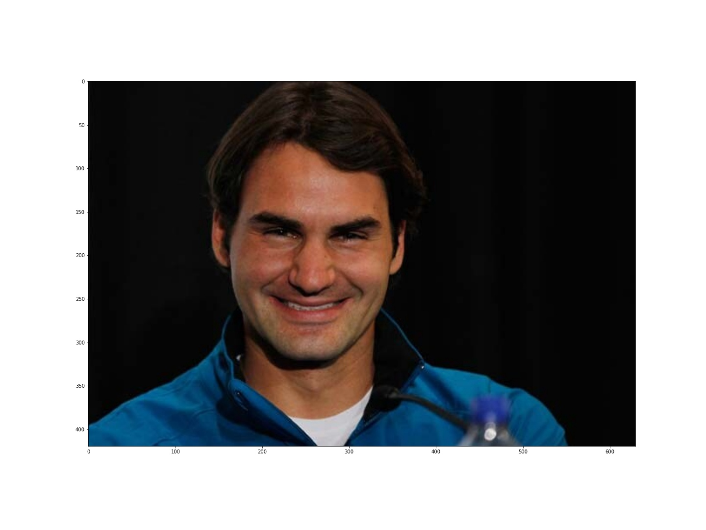
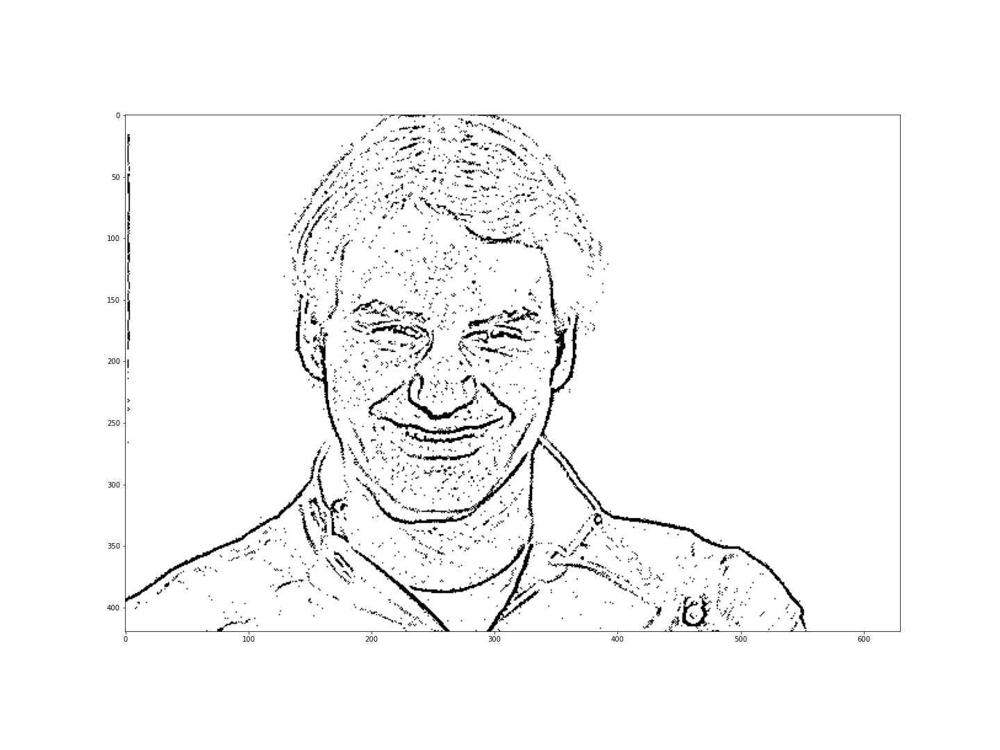
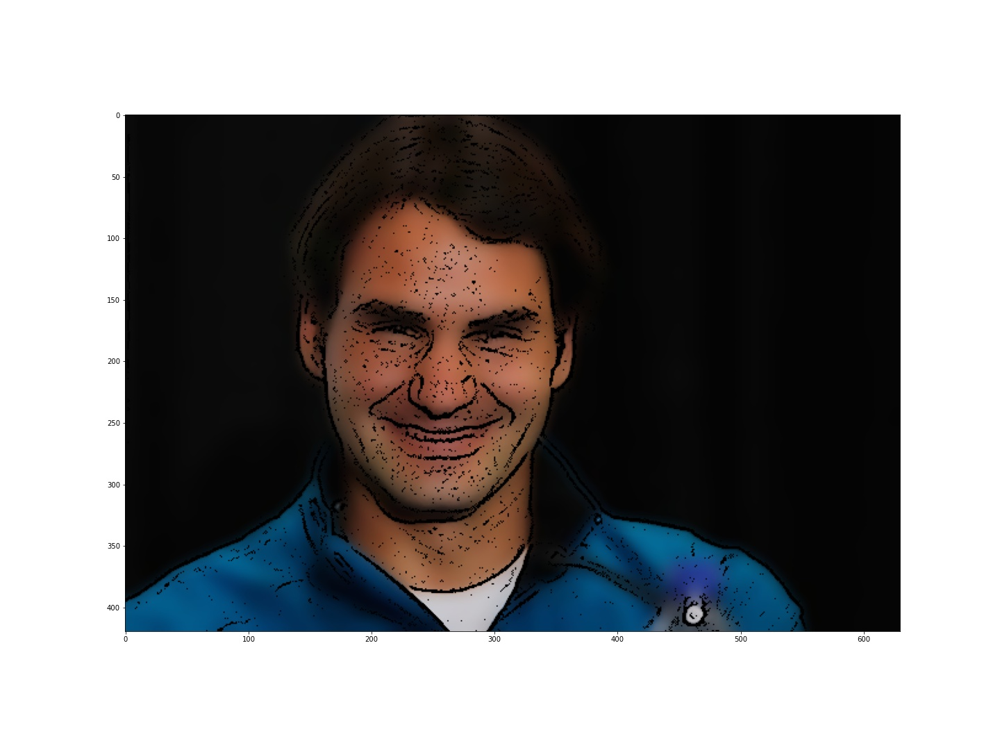

# Instagram-Filter-Replications
Using OpenCV's image processing libraries, I tried to replicate instagram filters such as pencil sketch and cartoonify.

I have used techniques such as Bilateral Filtering & Laplacian Kernels to implement this. Consult the notebook for more information

## Packages Required:-

- Python3
- OpenCV
- Matplotlib
- Numpy

## How to run

All instruction given in the IPython Notebook.

## Methodology Used

Refer the Notebook for information.

## Output

From Top to Bottom- Original Image, Pencil-Sketched Image, Cartoonified Image

